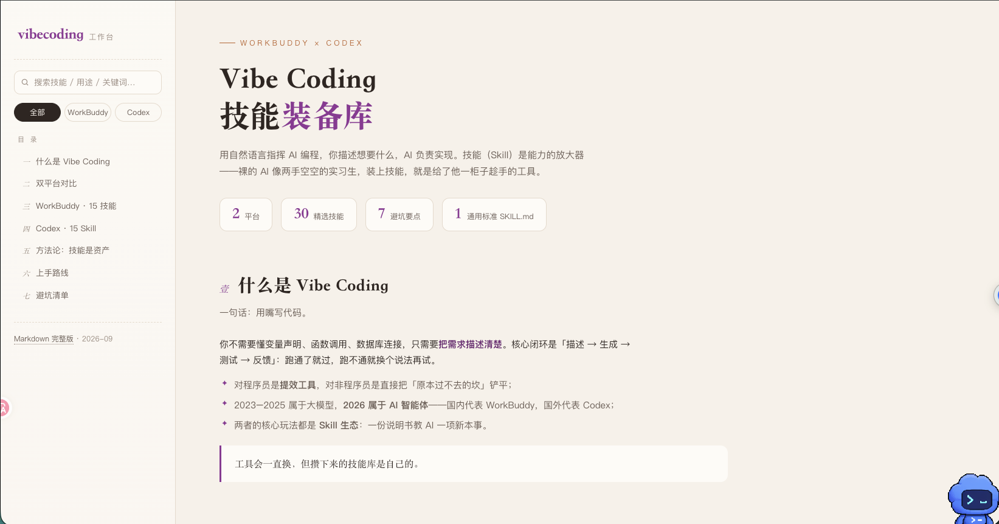

# vibecoding

Vibe Coding 指南 —— WorkBuddy × Codex 双平台技能装备库。

> **🌐 在线工作台**：<https://jdb156158.github.io/vibecoding/>
> 单文件网页版，支持目录导航、关键词搜索、平台筛选、安装命令一键复制。



## 内容

| 章节 | 说明 |
|---|---|
| 什么是 Vibe Coding | 用自然语言指挥 AI 编程：描述 → 生成 → 测试 → 反馈 |
| 双平台对比 | WorkBuddy（7 万+ 社区技能）vs Codex（39 个官方精选） |
| WorkBuddy · 15 技能 | 研究信息 / 知识管理 / 职场求职 / 视觉创作四大方向 |
| Codex · 15+1 Skill | 内置三件套、开发流程八件套、硬核补充、压轴两员、编外：Karpathy 四原则（省 token） |
| 方法论 | SKILL.md 通用标准，技能是可跨平台带走的资产 |
| 上手路线 | 两条路径：Codex 发布链 / WorkBuddy 信息流 |
| 避坑清单 | 技能装太多判断失准、Demo 陷阱等 7 条 |

## 仓库结构

```
vibecoding/
├── index.html           # 网页版工作台（单文件，离线可用）
├── vibecoding-guide.md  # Markdown 完整指南
├── ADD-SKILL.md         # 新增技能 · 数据刷新流程（后续加 skill 照此操作）
└── README.md
```

## 本地使用

`index.html` 无任何外部依赖，双击即可在浏览器打开；GitHub Pages 部署见上方在线链接。

## 更新记录

- 2026-09-17：初版指南 + 网页工作台，开启 GitHub Pages。
- 2026-09-17：新增「节省token的skill」分组 [Karpathy 四原则](https://github.com/multica-ai/andrej-karpathy-skills)——编码前思考 / 简洁优先 / 精准修改 / 目标驱动执行，更少的 diff、更精简的代码，更省 token。Codex 计为第 16 个技能。
